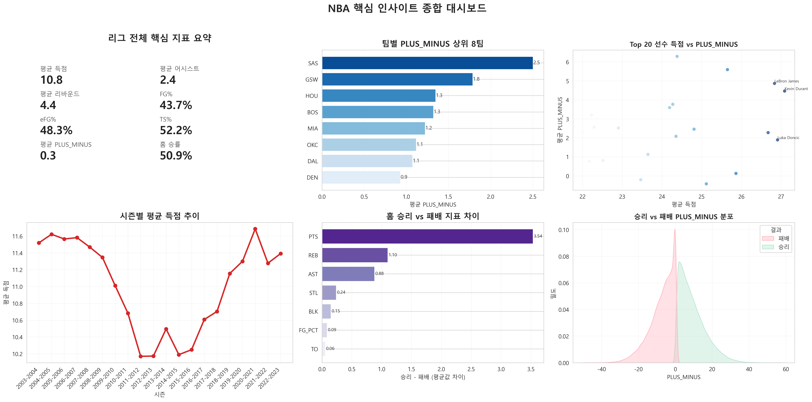
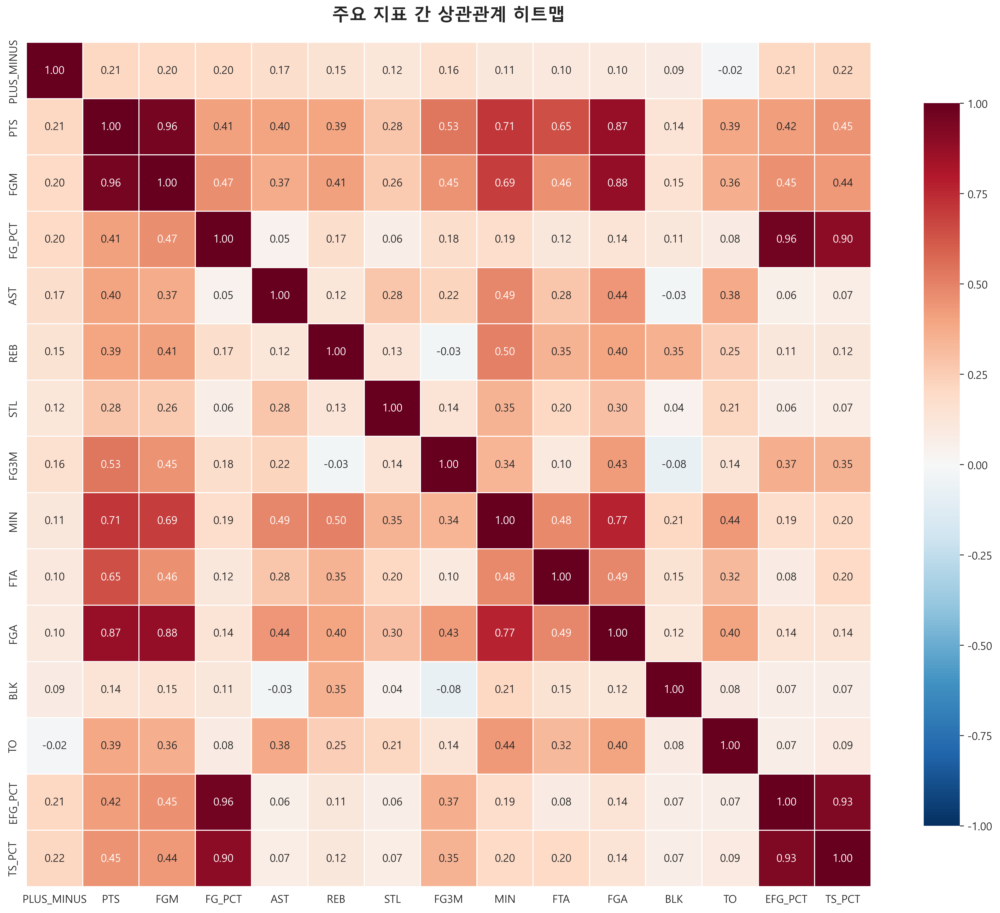

# nba-game-player-analysis

NBA 공개 데이터를 활용해 `무엇이 승리를 만드는가`, `선수의 다음 경기 성과를 어디까지 예측할 수 있는가`, `플레이 스타일을 어떻게 해석 가능한 그룹으로 나눌 수 있는가`를 다룬 프로젝트입니다. 단순 팬심 프로젝트가 아니라 `EDA -> 통계 검정 -> 지도학습 -> 비지도학습 -> 시각화`를 한 저장소 안에서 끝까지 연결하는 분석 역량을 보여주는 데 초점을 맞췄습니다.

## 빠른 판단

| 항목 | 내용 |
|------|------|
| 해결하려는 문제 | 승리 요인, 선수 성과, 플레이 스타일을 각각 따로 보지 않고 하나의 분석 파이프라인으로 정리할 수 있는가 |
| 실제 의사결정 가치 | 코칭 포인트, 라인업/선수 기용, 유사 선수 탐색, 팀 전술 해석에 활용 가능한 인사이트 제공 |
| 재현 가능한 범위 | 공개 Kaggle CSV 다운로드 후 전처리, EDA, 통계 검정, ML, 시각화까지 `NBA_통합_파이프라인.py`로 재현 가능 |
| 재현 불가능한 범위 | 저장소만 클론한 직후 동일 결과 확인. 원본 CSV 4개 다운로드가 필요 |
| 대체 확인 방법 | [대표 이미지](#대표-이미지), [머신러닝 인사이트 문서](./docs/NBA_머신러닝_인사이트.md), [재현성 가이드](./docs/reproducibility_and_validation.md) |

## 왜 이 프로젝트가 가치 있었는가

- 승패 요인, 선수 성과, 스타일 군집을 분리하지 않고 하나의 데이터 파이프라인으로 묶었습니다.
- 통계 검정과 머신러닝을 같이 사용해 "상관관계 설명"과 "예측 가능성"을 분리해서 보여줬습니다.
- 결과를 팀 전술, 선수 기용, 스카우팅 관점으로 번역해 단순 취미 분석에서 멈추지 않게 만들었습니다.

## 검증 요약

| 구분 | 핵심 수치 | 의미 | 근거 |
|------|-----------|------|------|
| 승리 요인 해석 | `eFG%`, `TS%`, `AST`가 핵심 | 단순 득점량보다 효율과 볼 순환이 승리에 더 강하게 연결 | [docs/NBA_분석플로우.md](./docs/NBA_분석플로우.md), [docs/NBA_비즈니스_전략.md](./docs/NBA_비즈니스_전략.md) |
| 선수 성과 예측 | 문서 기준 `R² > 0.6` | 다음 경기 성과를 완전히 맞히는 것이 아니라 설명 가능한 수준의 예측력을 확보 | [docs/NBA_머신러닝_인사이트.md](./docs/NBA_머신러닝_인사이트.md) |
| 예측-실측 일치 | 상관관계 약 `0.68~0.72` | 예측값이 실제 경기 결과와 방향성을 공유 | [docs/NBA_머신러닝_인사이트.md](./docs/NBA_머신러닝_인사이트.md) |
| 오차 수준 | PLUS_MINUS 평균 오차 `±2.5`, PTS 평균 오차 `±3.2` | 선수 기용/비교에 쓸 수 있는 수준의 회귀 오차를 문서화 | [docs/NBA_머신러닝_인사이트.md](./docs/NBA_머신러닝_인사이트.md) |
| 스타일 해석 | K-Means `5그룹` | 득점형, 플레이메이커, 리바운더, 올라운더, 역할선수 구분 | [docs/NBA_프로젝트_설명서.md](./docs/NBA_프로젝트_설명서.md) |

## 대표 이미지

### 종합 대시보드



### 상관관계 히트맵



## 공개 저장소에서 확인할 수 있는 것

1. [재현성/검증 가이드](./docs/reproducibility_and_validation.md)에서 데이터 준비와 확인 포인트를 먼저 봅니다.
2. [문서 인덱스](./docs/README.md)에서 공개 검토 순서와 핵심 자산 위치를 빠르게 확인합니다.
3. [NBA_통합_파이프라인.py](./NBA_통합_파이프라인.py)로 전체 엔트리 포인트를 확인합니다.
4. [docs/NBA_머신러닝_인사이트.md](./docs/NBA_머신러닝_인사이트.md)에서 예측/군집 결과를 읽습니다.
5. [outputs/](./outputs/)의 PNG 산출물로 결과 화면을 빠르게 검토합니다.

## 데이터와 실행

- 입력 데이터: `games.csv`, `games_details.csv`, `players.csv`, `teams.csv`
- 출처: [NBA Games - Nathan Lauga (Kaggle)](https://www.kaggle.com/datasets/nathanlauga/nba-games/data)
- 실행:

```bash
pip install -r requirements.txt
python NBA_통합_파이프라인.py
```

- 선택 실행: `--skip-preprocessing`, `--skip-eda`, `--skip-statistics`, `--skip-visualization`, `--skip-ml`

## 엔지니어링 신호

| 항목 | 내용 |
|------|------|
| Entry point | [NBA_통합_파이프라인.py](./NBA_통합_파이프라인.py) |
| 모듈 책임 분리 | 전처리, EDA, 통계 검정, ML, 시각화를 파일 단위로 분리 |
| 분석 구조 | 가설 -> 검정 -> 예측 -> 군집 -> 시각화 순서로 문서와 코드가 연결 |
| 공개 기준 | 원본 CSV와 대용량 전처리 결과 제외, 코드/문서/PNG 중심 공개 |
| 자동 검증 | 공개 자산 체크 + synthetic dataframe 기반 smoke test로 최소 재현 신뢰도 확보 |

## 더 보기

- 프로젝트 설명서: [docs/NBA_프로젝트_설명서.md](./docs/NBA_프로젝트_설명서.md)
- 문서 인덱스: [docs/README.md](./docs/README.md)
- 머신러닝 인사이트: [docs/NBA_머신러닝_인사이트.md](./docs/NBA_머신러닝_인사이트.md)
- 비즈니스 전략: [docs/NBA_비즈니스_전략.md](./docs/NBA_비즈니스_전략.md)
- 재현성/검증 가이드: [docs/reproducibility_and_validation.md](./docs/reproducibility_and_validation.md)
- 변경 이력: [CHANGELOG.md](./CHANGELOG.md)
